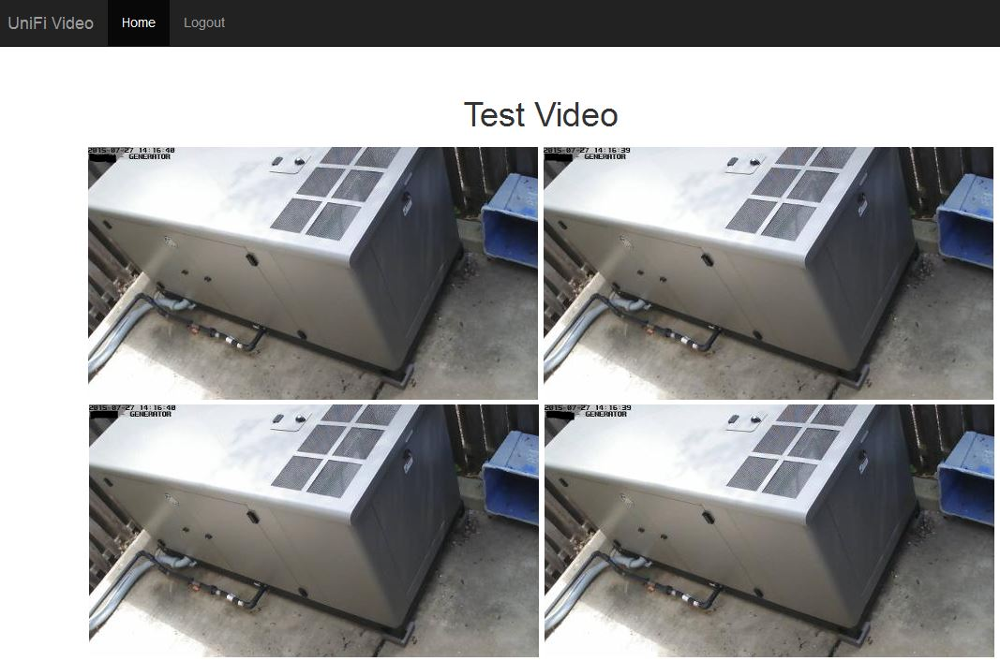

This script uses the API found in the UniFi Video NVR v3 to grab an image from a specific camera and loop that image to create a faux 
video. This is the same way the image is displayed in the camera's local web interface and why I chose to do it this way. 

RTSP does not work well with browsers so this HTML5 compliant solution was created.

# PREREQUISITE

### SOFTWARE

#### PHP
php5 php5-json

# SETUP
1. Set the domain or ip address, port, and API key in config.php

# USAGE
1. Go to index.php and login
2. Camera will load an image every 500ms or as long as it needs to get from NVR

# MULTIPLE CAMERAS
All cameras assigned to the API key's user will be displayed

# Authentication
By Default the login is user = admin and password = password

### CHANGE PASSWORD
Generate a new sha256 hash and insert into config/config.php

### DISABLE AUTHENTICATION
To disable authentication set $auth = "false"; in config/config.php

# TIPS
### Zoom
To Zoom double click on any camera.

# SCREENSHOTS

